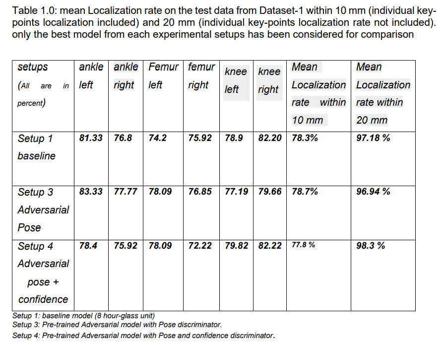
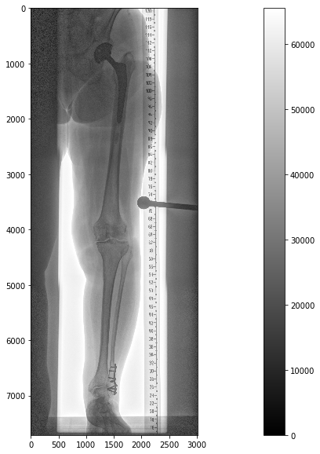

# AdversarialPoseNet-2DMedical
Investigation of adversarial learning for landmark localization in 2D medical images (lower extrimites)


Pytorch implementation of chen et al. "Adversarial PoseNet" for landmark localization on medical data.
The method was  proposed by [Yu Chen, Chunhua Shen, Xiu-Shen Wei, Lingqiao Liu, Jian Yang](https://scholar.google.com/citations?user=IWZubqUAAAAJ&hl=zh-CN) in 
[Adversarial PoseNet: A Structure-aware Convolutional Network for Human Pose Estimation](https://arxiv.org/pdf/1705.00389). 


## Lanmark localization 


##  Results Visualization
The results of this implementation:

### Adversarial PoseNet:


### Stack-hour-glass Network(supervised setup):
 

### localization rate of diffent setups on the test split:




## Main Prerequisites
- pytorch
- OpenCV
- Hiwi(FH Kiel Internal package)
- Numpy
- Scipy-images
```The list of dependencies can be found in the the requirements.txt file. Simply use pip install -r requirements.txt to install them.```


## Getting Started
### Installation
- Install Pytorch from https://pytorch.org/get-started/locally/
- Clone this repo:
```bash
git clone https://github.com/abhishekdiphu/AdversarialPoseNet-2DMedical.git
cd AdversarialPoseNet-2DMedical
```

### Train
- Download a dataset (e.g. zebra and horse images from ImageNet):
```bash
bash ./download_dataset.sh horse2zebra
```
- Train a model:
```bash
CUDA_VISIBLE_DEVICES=0 python main.py --dataset_dir=horse2zebra
```
- Use tensorboard to visualize the training details:
```read the files inside the log/ folder
```

### Test
- Finally, test the model:
```bash
CUDA_VISIBLE_DEVICES=0 python main.py --dataset_dir=horse2zebra --phase=test --which_direction=AtoB
```

## Training and Test Details
To train a model,  
```bash
CUDA_VISIBLE_DEVICES=0 python main.py --dataset_dir=/path/to/data/ 
```
Models are saved to `./checkpoints/` (can be changed by passing `--checkpoint_dir=your_dir`).  

To test the model,
```bash
CUDA_VISIBLE_DEVICES=0 python main.py --dataset_dir=/path/to/data/ --phase=test --which_direction=AtoB/BtoA
```

## Datasets


- `lower leg datasets`: The dataset includes around 660 2D medical images. They are grayscale in nature. each lower leg radiograph image in the dataset has been labelled with 6 joint co-ordinate, one each for distinct epiphyses parts ( bone extremities ) femur, ankle , knee for both the legs. The size of each of the image is approximately 7300 x 2800 pixels. Here in this resolution, isotopic range is .143mm = 1 px.

   


## Reference
- The pytorch implementation of stacked-hour-glass, https://github.com/princeton-vl/pytorch_stacked_hourglass
- The pytorch implementation of self-adversarial pose estimation, https://github.com/roytseng-tw/adversarial-pose-pytorch
- The torch implementation of self-adversarial pose estimationh , https://github.com/dongzhuoyao/jessiechouuu-adversarial-pose

