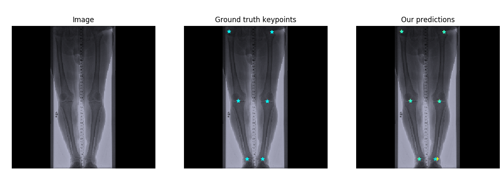

# AdversarialPoseNet-2DMedical
Yu Chen's Adversarial-PoseNet for landmark localization in 2D medical images (lower extrimites)


Pytorch implementation of chen et al. "Adversarial PoseNet" for landmark localization on medical data.
The method was  proposed by [Yu Chen, Chunhua Shen, Xiu-Shen Wei, Lingqiao Liu, Jian Yang](https://scholar.google.com/citations?user=IWZubqUAAAAJ&hl=zh-CN) in 
[Adversarial PoseNet: A Structure-aware Convolutional Network for Human Pose Estimation](https://arxiv.org/pdf/1705.00389). 

## Goal
The goal of this work will be to investigate the role of adversarial learning for keypoint localization of 6 landmarks in lower extremities taken from dataset of 660 X-ray
images by incorporating priors about the structure of the lower extremities pose
components implicitly during the training of a network. For this analysis, an already
established generative adversarial network architecture is being presented which predicts
heatmaps. The effectiveness of the network is trained and tested on the X-ray medical
images of lower extremities and evaluated in terms of localization accuracy (within 10 mm
tolerance).
   Occlusions in medical images happens due to certain causes such as putting
prosthetics on the bone joints or restricted view, making it harder for landmark localization.
However, under this conditions, human vison can predict near accurate poses by
exploiting geometric orientation of joint inter-connectivity between bones in the medical
images.
## Adversarial training :
### Generator training : 
- 𝐿𝑝(𝐺, 𝑃) = 𝐸[𝑙𝑜𝑔𝑃(𝑦, 𝑥)] + 𝐸[𝑙𝑜𝑔(1 − 𝑃(𝐺(𝑥), 𝑥) − 𝑝_𝑓𝑎𝑘𝑒)] ,
𝑤ℎ𝑒𝑟𝑒 𝑦 𝑎𝑟𝑒 𝑡ℎ𝑒 𝑔𝑟𝑜𝑢𝑛𝑑𝑡𝑟𝑢𝑡ℎ ℎ𝑒𝑎𝑡𝑚𝑎𝑝𝑠 , P is Pose distriminator.
𝐺(𝑥) , 𝑎𝑟𝑒 𝑡ℎ𝑒 𝑔𝑒𝑛𝑒𝑟𝑎𝑡𝑒𝑑 ℎ𝑒𝑎𝑡𝑚𝑎𝑝𝑠, 𝑥 𝑎𝑟𝑒 𝑡ℎ𝑒 𝑖𝑛𝑝𝑢𝑡 𝑖𝑚𝑎𝑔𝑒.

- 𝐿𝑝(𝐺, C) = 𝐸[𝑙𝑜𝑔C(𝑦)] + 𝐸[𝑙𝑜𝑔(1 − C(𝐺(𝑥)) − c_𝑓𝑎𝑘𝑒)] ,
𝑤ℎ𝑒𝑟𝑒 𝑦 𝑎𝑟𝑒 𝑡ℎ𝑒 𝑔𝑟𝑜𝑢𝑛𝑑𝑡𝑟𝑢𝑡ℎ ℎ𝑒𝑎𝑡𝑚𝑎𝑝𝑠 , P is Pose distriminator.
𝐺(𝑥) , 𝑎𝑟𝑒 𝑡ℎ𝑒 𝑔𝑒𝑛𝑒𝑟𝑎𝑡𝑒𝑑 ℎ𝑒𝑎𝑡𝑚𝑎𝑝𝑠, 𝑥 𝑎𝑟𝑒 𝑡ℎ𝑒 𝑖𝑛𝑝𝑢𝑡 𝑖𝑚𝑎𝑔𝑒.

## Sample input images (left) & its corresponding ground truth heatmap(right): 


##  Results Visualization
The results of this implementation:

### Adversarial PoseNet:



### Stack-hour-glass Network(supervised setup):
 

### localization rate(percentage of correct keypoints) within 10 mm  on the test set:


```
 please note : localization rate(percentage of correct keypoints) within 20 mm was on average 98% accross all six landmarks. 
```

### Metric Used :
 ```
-.Euclidian distance (predicted co-ordinates , ground-truth co-ordinates) < 10 mm
-.Euclidian distance (predicted co-ordinates , ground-truth co-ordinates) < 20 mm
```
#### for more information refer: 
- ["Detection and Localization of Landmarks in the Lower Extremities Using an Automatically Learned 
Conditional Random Field](https://www.researchgate.net/publication/319634278_Detection_and_Localization_of_Landmarks_in_the_Lower_Extremities_Using_an_Automatically_Learned_Conditional_Random_Field)
- regarding image spacing refer [simpleitk](https://simpleitk.readthedocs.io/en/v1.2.4/Documentation/docs/source/fundamentalConcepts.html#images)


## Main Prerequisites
- pytorch
- OpenCV
- Hiwi(FH Kiel Internal package)
- Numpy
- scikit-image
- ```The list of dependencies can be found in the the requirements.txt file. Simply use pip install -r requirements.txt to install them.```


## Getting Started
### Installation
- Install Pytorch from https://pytorch.org/get-started/locally/
- Clone this repo:
```bash
git clone https://github.com/abhishekdiphu/AdversarialPoseNet-2DMedical.git
cd AdversarialPoseNet-2DMedical
```


## Training and Test Details
To train a model, run any of the .sh file starting with "train". for example  
```bash
trainmodelmedical-exp-22.sh 
```
- A bash file has following configurations, that one can change 
```
python trainmodeladversarial-pos-conf-exp24.py \
--path handmedical \
--modelName trainmodel \
--config config.default_config \
--batch_size 1 \
--use_gpu \
--lr .0002 \
--print_every 100 \
--train_split 0.804 \
--loss mse \
--optimizer_type Adam \
--epochs 50 \
--dataset  'medical' 

```
- During training , one can see how the network is learning on batch of input samples by looking inside the folder 
```
trainingImages/  and can also visualize the area of interest of the network during training, 
while localizing the keypoints on the images , by using the 
localization maps of the last convolutional layers as shown below:
```
 


Models are saved to `./trainmodel/` (can be changed in the --modelName).  

To test the model,
```bash
test.sh
```

## Datasets


- `lower leg datasets`: The dataset includes around 660 2D medical images. They are grayscale in nature. each lower leg radiograph image in the dataset has been labelled with 6 joint co-ordinate, one each for distinct epiphyses parts ( bone extremities ) femur, ankle , knee for both the legs. The size of each of the image is approximately 7300 x 2800 pixels. Here in this resolution, isotopic range is .143mm = 1 px.
- Distribution of landmarks accross the dataset:


The dataset is not publically available , and has been taken from the authors of the paper ,

["Detection and Localization of Landmarks in the Lower Extremities Using an Automatically Learned 
Conditional Random Field](https://www.researchgate.net/publication/319634278_Detection_and_Localization_of_Landmarks_in_the_Lower_Extremities_Using_an_Automatically_Learned_Conditional_Random_Field)


   


## Reference
- The pytorch re-implementation of stacked-hour-glass, https://github.com/princeton-vl/pytorch_stacked_hourglass
- The pytorch re-implementation of self-adversarial pose estimation, https://github.com/roytseng-tw/adversarial-pose-pytorch
- The torch   implementation of self-adversarial pose estimation, https://github.com/dongzhuoyao/jessiechouuu-adversarial-pose
- The pytorch re-implementation of Adversarial-Pose-Net,https://github.com/rohitrango/Adversarial-Pose-Estimation

